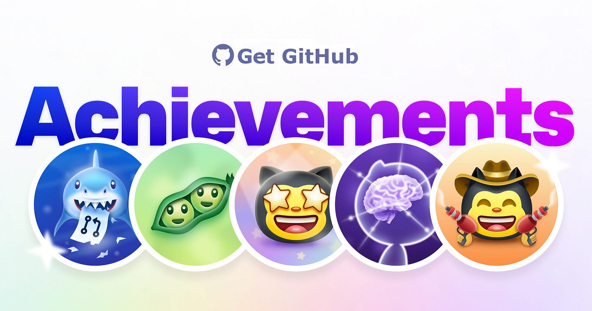

<h1 align="center">Welcome to GitHub Achievement Viewer</h1>

<h2 align="center">Here you can see all the achievements and badges available on GitHub!</h2>

<h4 align="center">Displaying achievements on your profile is completely optional by default, they can be seen by anyone viewing your public profile.</h4>

<h4 align="center">You can turn off achievements being displayed on your profile by going to your <a href="https://github.com/settings">profile settings</a>.</h4> 

<h1 align="center">Obtainable Achievements List</h1>

<h4 align="center">That list contains every single achievement and requirements you need to get the achievement.</h4>

| Badge | Name | How to get | Required amount | 
| :-: | :-: | :-: | :-: |
|                  | Starstruck         | Created a repository that has many stars | <table>  <thead>  <tr>  <th>DEFAULT</th> <th>BRONZE</th>  <th>SILVER</th>  <th>GOLD</th>  </tr>  </thead>  <tbody>  <tr>  <td align="center"></td>   <td></td>  <td></td>  <td></td>  </tr>  <tr>  <td align="center">16</td>  <td align="center">128</td>  <td align="center">512</td>  <td align="center">4096</td>  </tr>   </tbody>  </table>      |
|      | Pair Extraordinaire  | [Coauthored](https://docs.github.com/pull-requests/committing-changes-to-your-project/creating-and-editing-commits/creating-a-commit-with-multiple-authors) commits on merged pull request | <table>  <thead>  <tr>  <th>DEFAULT</th> <th>BRONZE</th>  <th>SILVER</th>  <th>GOLD</th>  </tr>  </thead>  <tbody>  <tr>  <td align="center"></td>   <td></td>  <td></td>  <td></td>  </tr>  <tr>  <td align="center">1</td>  <td align="center">10</td>  <td align="center">24</td>  <td align="center">48</td>  </tr>   </tbody>  </table>      |
|      | Pull Shark  | Opened a pull request that has been merged | <table>  <thead>  <tr>  <th>DEFAULT</th> <th>BRONZE</th>  <th>SILVER</th>  <th>GOLD</th>  </tr>  </thead>  <tbody>  <tr>  <td align="center"></td>   <td></td>  <td></td>  <td></td>  </tr>  <tr>  <td align="center">2</td>  <td align="center">16</td>  <td align="center">128</td>  <td align="center">1024</td>  </tr>   </tbody>  </table>      |
|  | Galaxy Brain | Answered a discussion (got an accepted answer) | <table>  <thead>  <tr>  <th>DEFAULT</th> <th>BRONZE</th>  <th>SILVER</th>  <th>GOLD</th>  </tr>  </thead>  <tbody>  <tr>  <td></td>  <td></td>  <td></td>  <td></td>  </tr>  <tr>  <td align="center">2</td> <td align="center">8</td>  <td align="center">16</td>  <td align="center">32</td>  </tr>   </tbody>  </table>
|                  | Quickdraw        | Gitty up! (closed an issue / pull request within 5 minutes of opening) | <table>  <thead>  <tr>  <th>DEFAULT</th>  </tr>  </thead>  <tbody>  <tr>  <td></td> </tr>  <tr>  <td align="center">1</td> </tr>   </tbody>  </table> |
|                  | YOLO        | Merged a pull request without a review | <table>  <thead>  <tr>  <th>DEFAULT</th>  </tr>  </thead>  <tbody>  <tr>  <td></td> </tr>  <tr>  <td align="center">1</td> </tr>   </tbody>  </table> |
|                  | Public Sponsor        | Sponsored an open source contributor through [GitHub Sponsors](https://github.com/sponsors) | <table>  <thead>  <tr>  <th>DEFAULT</th>  </tr>  </thead>  <tbody>  <tr>  <td></td> </tr>  <tr>  <td align="center">1</td> </tr>   </tbody>  </table> |

<h1 align="center">Testing Achievements List</h1>

<h4 align="center">This list contains achievements that were never released or were/are only tested.</h4>

| Badge | Name | How to get | Required Amount | 
| :-: | :-: | :-: | :-: |
|  | Heart On Your Sleeve | (???) | <table>  <thead>  <tr>  <th>DEFAULT</th> <th>BRONZE</th>  <th>SILVER</th>  <th>GOLD</th>  </tr>  </thead>  <tbody>  <tr>  <td align="center"></td>   <td></td>  <td></td>  <td></td>  </tr>  <tr>  <td align="center">(?)</td>  <td align="center">(?)</td>  <td align="center">(?)</td>  <td align="center">(?)</td>  </tr>   </tbody>  </table> |
|  | Open Sourcerer | (???) | <table>  <thead>  <tr>  <th>DEFAULT</th> <th>BRONZE</th>  <th>SILVER</th>  <th>GOLD</th>  </tr>  </thead>  <tbody>  <tr>  <td align="center"></td>   <td></td>  <td></td>  <td></td>  </tr>  <tr>  <td align="center">(?)</td>  <td align="center">(?)</td>  <td align="center">(?)</td>  <td align="center">(?)</td>  </tr>   </tbody>  </table> |

<h1 align="center">Unobtainable Achievements List</h1>

<h4 align="center">This list contains achievements that are not obtainable in any way anymore.</h4>

| Badge | Name | How to get | Required Amount | 
| :-: | :-: | :-: | :-: |
|      | Mars 2020 Contributor  | Contributed code to a repository used in the [Mars 2020 Helicopter Mission](https://github.com/readme/featured/nasa-ingenuity-helicopter) | <table>  <thead>  <tr>  <th>DEFAULT</th>  </tr>  </thead>  <tbody>  <tr>  <td></td> </tr>  <tr>  <td align="center">1</td> </tr>   </tbody>  </table> |
|  | Arctic Code Vault Contributor | Contributed code to a repository in the [2020 GitHub Archive Program](https://archiveprogram.github.com/) | <table>  <thead>  <tr>  <th>DEFAULT</th>  </tr>  </thead>  <tbody>  <tr>  <td></td> </tr>  <tr>  <td align="center">1</td> </tr>   </tbody>  </table> |

<h1 align="center">Achievement Skin Tones</h1>

<h4 align="center">Some achievements appearance depends on your Emoji Skin Tone Preference.</h4>

<h4 align="center">You can change your preferred Skin Tone by going to <a href="https://github.com/settings/appearance">appearance settings</a>.</h4>

| Badge | Name | Skin Tone Versions | 
| :-: | :-: | :-: |
|                  | Starstruck         | <table>  <thead>  <tr>  <th>👋</th> <th>👋🏻</th>  <th>👋🏼</th>  <th>👋🏽</th>  <th>👋🏾</th>  <th>👋🏿</th>  </tr>  </thead>  <tbody>  <tr>  <td align="center"></td>   <td align="center"></td>  <td align="center"></td>  <td align="center"></td>  <td align="center"></td>   <td align="center"></td>   </tr>   <tr>  <td align="center">👋</td> <td align="center">👋🏻</td>  <td align="center">👋🏼</td>  <td align="center">👋🏽</td>  <td align="center">👋🏾</td>  <td align="center">👋🏿</td>  </tr>  </tbody>  </table>      |
|                  | Quickdraw         | <table>  <thead>  <tr>  <th>👋</th> <th>👋🏻</th>  <th>👋🏼</th>  <th>👋🏽</th>  <th>👋🏾</th>  <th>👋🏿</th>  </tr>  </thead>  <tbody>  <tr>  <td align="center"></td>   <td align="center"></td>  <td align="center"></td>  <td align="center"></td>  <td align="center"></td>   <td align="center"></td>   </tr>   <tr>  <td align="center">👋</td> <td align="center">👋🏻</td>  <td align="center">👋🏼</td>  <td align="center">👋🏽</td>  <td align="center">👋🏾</td>  <td align="center">👋🏿</td>  </tr>  </tbody>  </table>      |

<h1 align="center">Highlight Badges</h1>

<h4 align="center">That list contains every single highlight badge and requirements to get the badge.</h4>

| Badge | Name | How to get |
| :-: | :-: | :-: |
|   | Pro | Use [GitHub Pro](https://docs.github.com/en/get-started/learning-about-github/githubs-products#github-pro) |
|  | Developer Program Member | Be a registered member of the [GitHub Developer Program](https://docs.github.com/en/developers/overview/github-developer-program) |
|  | Security Bug Bounty Hunter | Helped out hunting down security vulnerabilities at [GitHub Security](https://bounty.github.com/) |
|  | GitHub Campus Expert | Participate in the [GitHub Campus Program](https://education.github.com/experts) |
|  | Security advisory credit | Have your security advisory submitted to the [GitHub Advisory Database](https://github.com/advisories) accepted |

<h1 align="center">Thanks for checking out this repository!</h1>

<h4 align="center">If it helped consider leaving a star!</h4>

<h4 align="center">You can also check out my other repositories!</h4>

<h4 align="center">⭐⭐⭐</h4>
